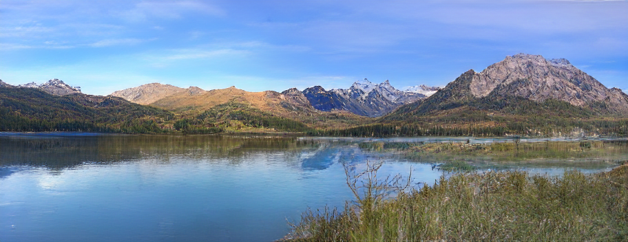
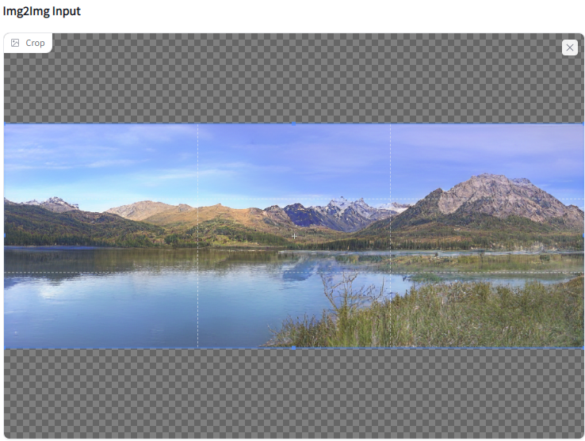
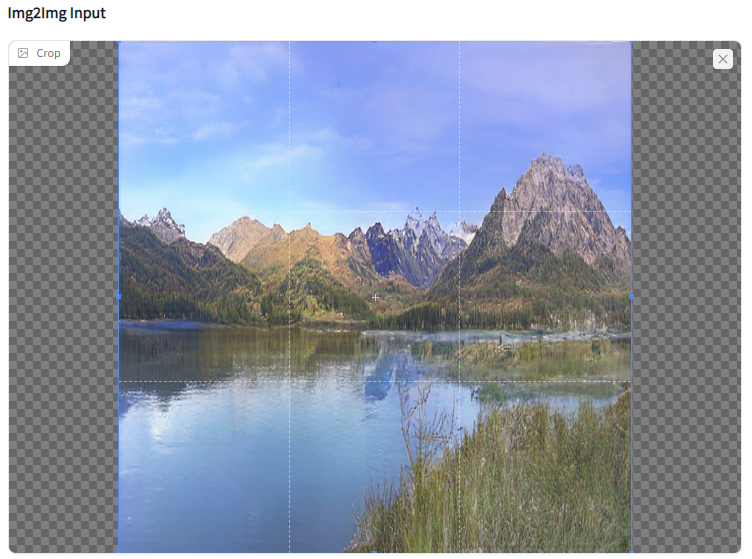
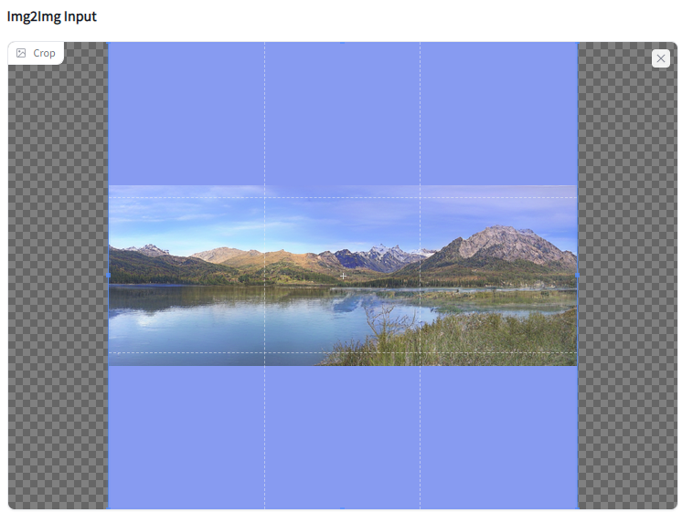
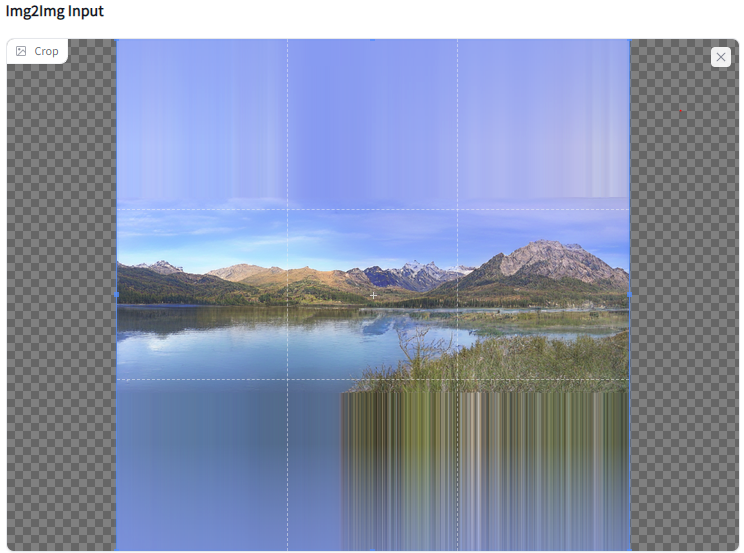
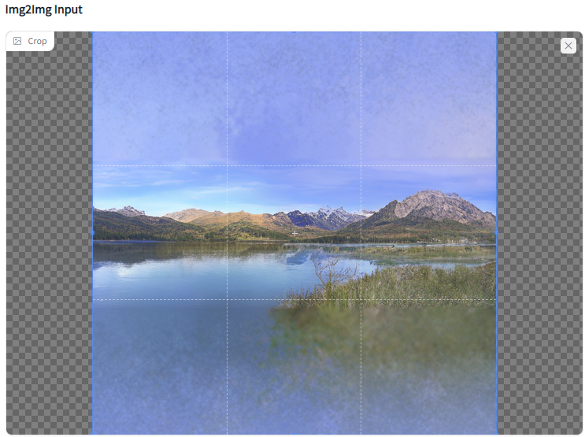
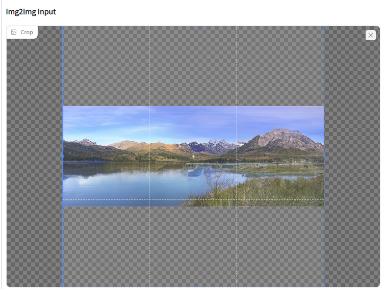
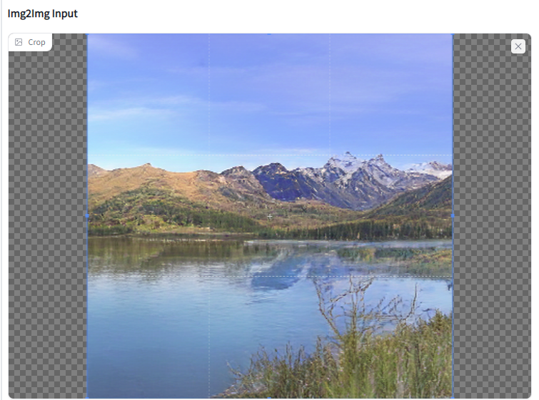
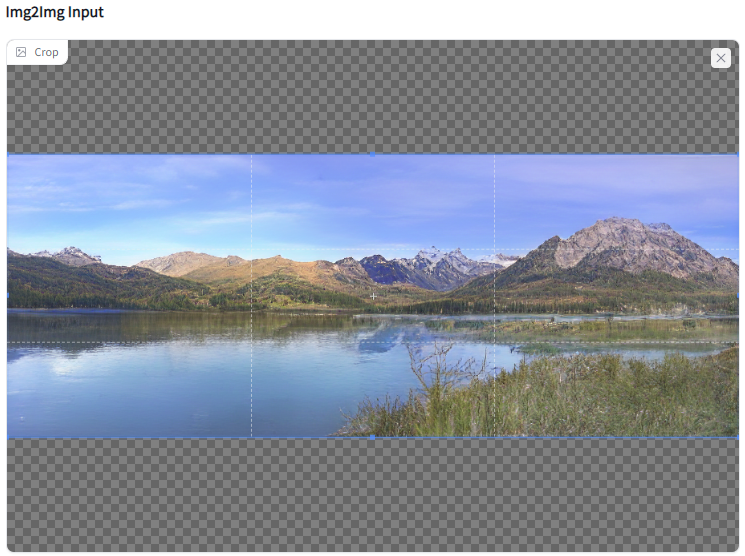
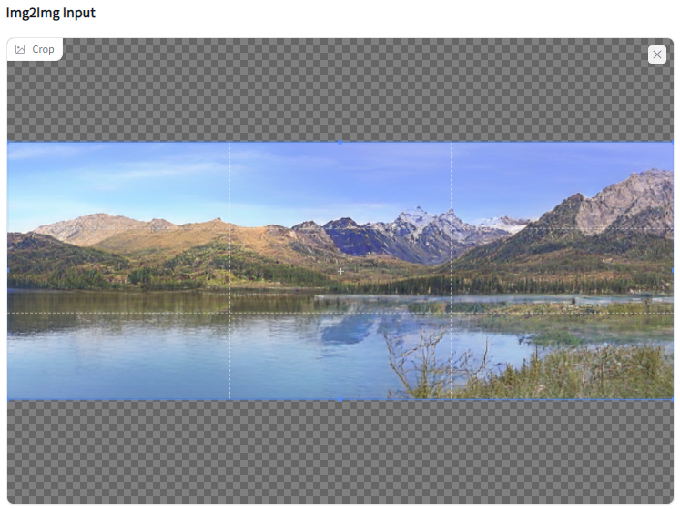

<!--
This file is part of stable-diffusion-webui (https://github.com/sd-webui/stable-diffusion-webui/).

Copyright 2022 sd-webui team.
This program is free software: you can redistribute it and/or modify
it under the terms of the GNU Affero General Public License as published by
the Free Software Foundation, either version 3 of the License, or
(at your option) any later version.

This program is distributed in the hope that it will be useful,
but WITHOUT ANY WARRANTY; without even the implied warranty of
MERCHANTABILITY or FITNESS FOR A PARTICULAR PURPOSE.  See the
GNU Affero General Public License for more details.

You should have received a copy of the GNU Affero General Public License
along with this program.  If not, see <http://www.gnu.org/licenses/>.
-->

## Resize image
Initially intended to do pre-processing to the input image as to quickly adjust the image composition and fill the canvas with some pixel data,
the development quickly escalated into a creative tool and small image processor.
Interesting patterns and compositions can be obtained to further pre optimize the diffusion generation process and ie. avoid cropped endresults by providing enough upfront pixel data and image real estate.

Fill backgrounds with a pîcker or automated colour samplers: 'auto_edge' for the most occuring colour around the image edges, 'auto' for most occuring colour in the whole image.

Save your settings as a custom preset and use the sequencer to combine them one after another as a macro script. You can also save these runs as a new preset.

Use 'debug' to see the more complicated image algorithms in steps.

Note: Most of the commands are destructive to the original input image so best to save your work before proceeding.

Note: when using the gradio cropping rectangle tool in the ui, make sure you properly update the tool by clicking the tool again after dragging to complete the edit. 
This is often not properly called in the ui, keeping it in an edit state without committing.

TODO: implement this to run with feedback looping when generating.
TODO: implement nested processing using preset sequences within preset sequences

### example input image

lake_in_the_mountains.png

## The current algorithms are:

### Dont resize
Don't do anything to the image provided by the ui, currently used for switching image modes (crop/mask) and useful to quickly store sequence presets.
Can be used to just crop the image using the interactive UI, as it passes only the selection.

### Stretch
Stretch all four sides of the image to fit the output size resulting in a disproportionate stretch. 

### Resize and fill bg
Fill the background with a flat colour.

### Repeat edges
Resize the content bounds and fill the empty canvas with the stretched pixels of the border, typically the last pixel rows. 
When using more than a single pixel row, interesting patterns can be created.
There is also an option to mask this repeated pattern with a flat background colour to get some more composition options.

### Scatter Fill
This scatters random pixels like mushroom spores over an empty canvas and is based on the border of the input. 
In a second pass it cultivates and blends these pixels locally into larger clusters that yield in a more complex, artistic, organic fill.
When using a border thickness a border is added around the image before the process and compresses the effect within the image frame. 
The final pixel scatter is then layered behind the input image yielding the effect of a rudimentary abstract uncrop.

### Fill Content Proportionally
Scale the image as to proportionally fill the content to the output size. No part of the image is lost, empty canvas may be added.

### Fill Frame Proportionally
Scale the image as to fully fill the output frame while keeping the content proportionally. Some part of the image is usually cropped.

### Crop Content
Crop the image to its content bounding box (square/rectangle). Any transparency, 100% black and 100% white borders will get cropped; if any. 
Note: our example image will just return its own image as there is none of the above.

### Zoom
Crop inward or outward resulting in a zoom effect when going inward or outward. The amount is based on the percentage of the current image size.
The example below was cropped with the value of 0.3
tip: Use this with a fill method to creatively zoom outward using preset sequences. 

## Enable Editor
This button was necessary to get around the gradio bug for updating the viewer correctly. 
Putting the viewer's Interactive mode to False also sped up the processing time and displayed the actual image size nicely.
You press it after resizing to get back to the editor gradio interactive mode.

## Save Resize Preset
Store custom resize presets by providing a name (located under advanced). These get stored on disk and are based on the default preset params that are shipped with the code.
These can get used by the "Resize Preset Sequence".

## Resize Preset Sequence
When you find yourself repeating some resize steps it can be useful to use this feature. 
If checked it ignores everything else and uses the sequence provided as a batch processor.
It searches your local '..\frontend\resize_presets' folder for .pickle files that match your sequence naming. 
The 'default' is not callable, but you can resave them under a different unique name.

### Resize Preset Sequence example

Crop content (cc) => fill content proportionally (fcp) => scatter fill background (scat)

This will first crop any borders or transparency in your image, then fit the content to the output resolution proportionally, 
and finally fill any background that you have missed with a scatter pattern.

1) Resave the featured defaults or custom presets to disk using unique names (ie. cc fcp scat)

2) tip: load a 'don't resize' default to use as blank sheet (to avoid confusion) and fill out the sequence

3) format the command cc;fcp;scat using ';' then check the checkbox 'resize using sequence'.

3) tip: save this as a new preset to recall later (ie. scat_seq)

4) run the sequence by hitting the 'resize' button

note: you cannot call multiple nested seq presets as of this point.